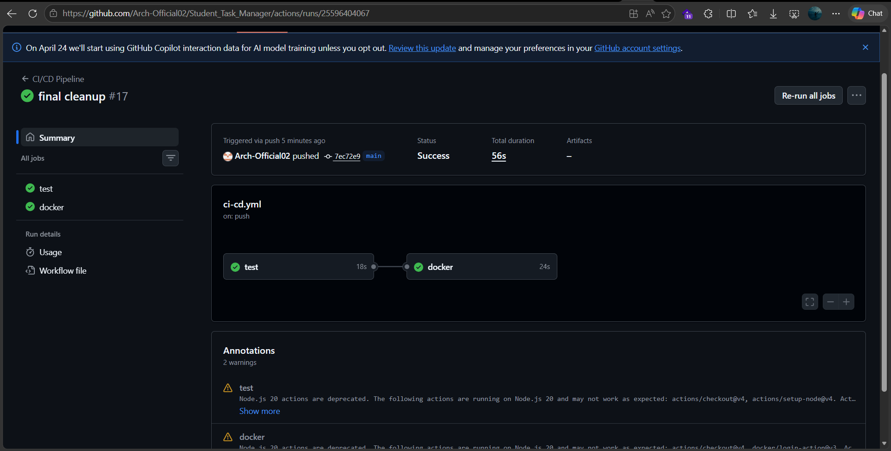
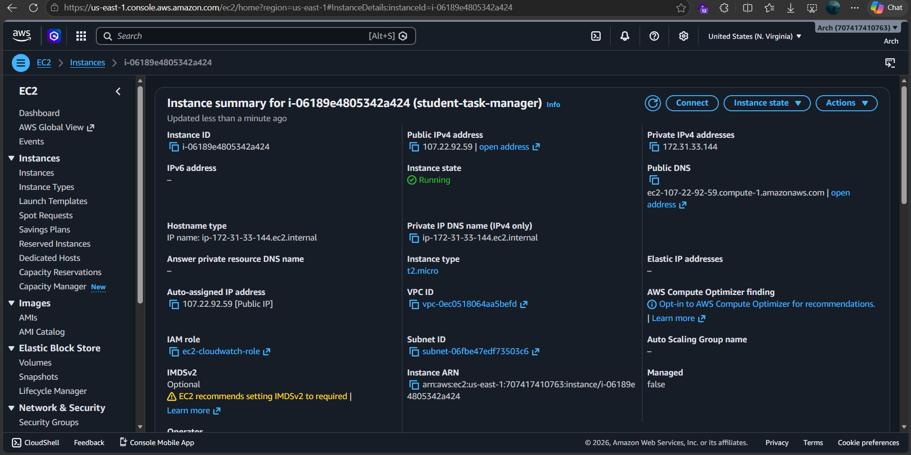
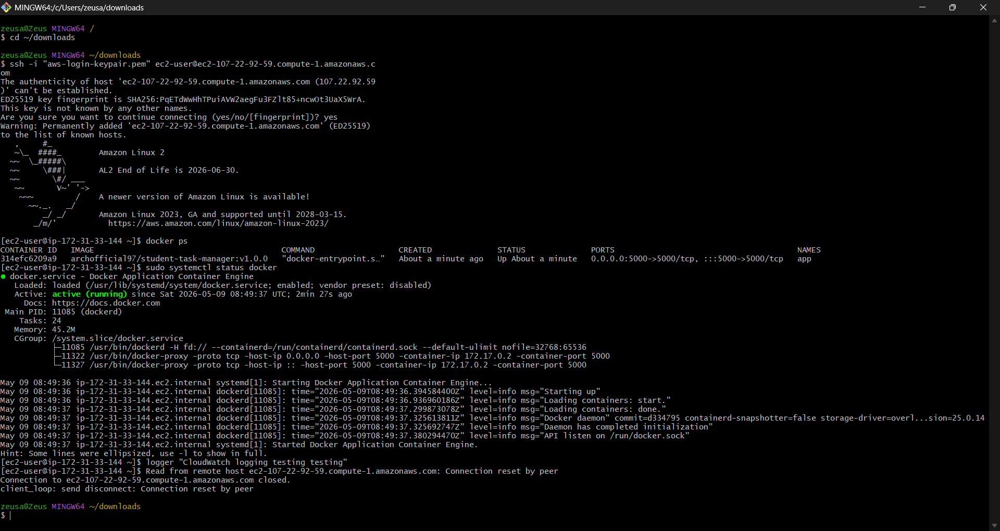
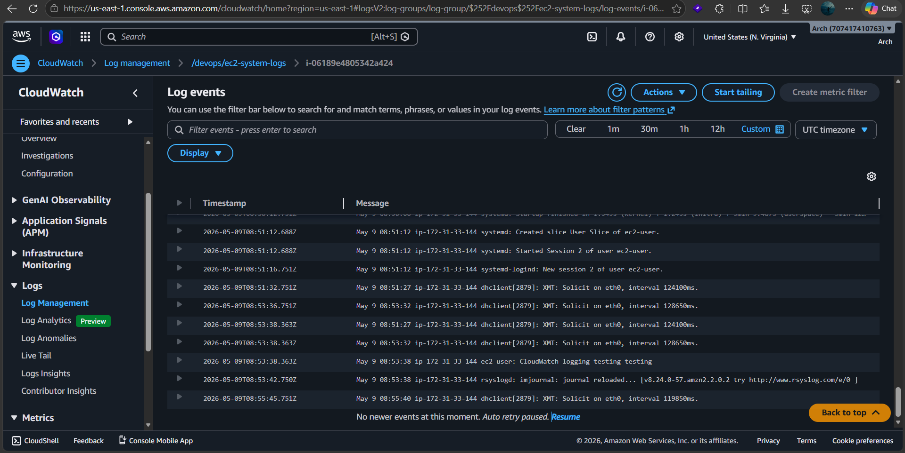
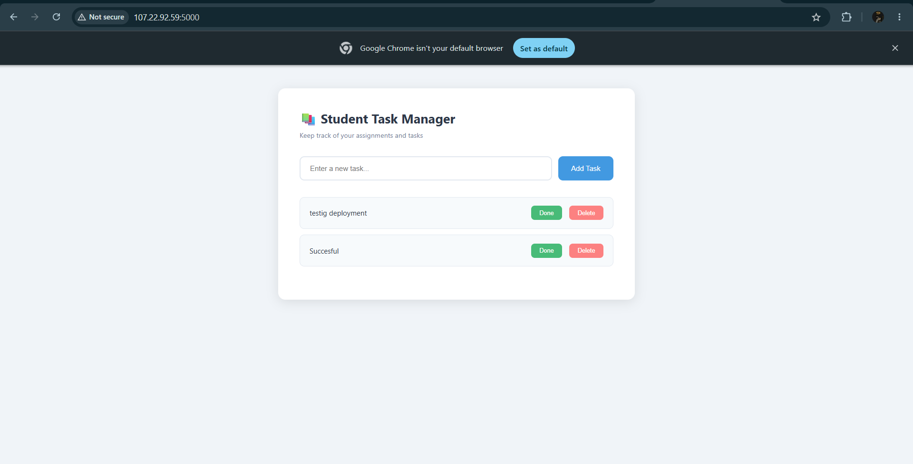

# Production-Ready Application Deployment

A production-ready DevOps deployment project demonstrating Infrastructure as Code, containerization, CI/CD automation, AWS deployment, and monitoring using modern DevOps practices.

# Project Overview

This project deploys a containerized Node.js web application to AWS EC2 using Terraform for infrastructure provisioning and GitHub Actions for CI/CD automation.

The deployment process is fully automated using EC2 user-data scripts and Docker.

Monitoring and logging are implemented using AWS CloudWatch Agent.

# Architecture Overview

## Deployment Flow

Developer Pushes Code
        ↓
GitHub Actions CI Pipeline
        ↓
Application Tested
        ↓
Docker Image Built
        ↓
Docker Image Pushed to DockerHub
        ↓
Terraform Provisions AWS Infrastructure
        ↓
EC2 Pulls Docker Image Automatically
        ↓
Container Starts Automatically
        ↓
CloudWatch Collects Logs

# Technologies Used

* Node.js
* Docker
* Terraform
* GitHub Actions
* AWS EC2
* AWS IAM
* AWS CloudWatch
* DockerHub

# Repository Structure

project-root/
│
├── app/
│   ├── public/
│   │   └── index.html
│   └── server.js
│
├── scripts/
│   └── deploy.sh
│
├── terraform/
│
├── tests/
│   └── app.test.js
│
├── Dockerfile
├── package.json
├── package-lock.json
└── README.md

# Infrastructure as Code

Terraform is used to provision:

* EC2 Instance
* Security Groups
* IAM Role
* IAM Instance Profile
* CloudWatch permissions

Infrastructure is modular, reusable, and repeatable.

# CI/CD Pipeline

GitHub Actions is used to automate the CI/CD workflow.

## CI Process

On every push to the `main` branch:

1. Source code is checked out
2. Node.js environment is configured
3. Dependencies are installed
4. Automated tests are executed

## CD Process

After successful testing:

1. Docker image is built
2. Image is pushed to DockerHub
3. EC2 automatically pulls and runs the latest image during deployment

---

# Containerization

The application is containerized using Docker to ensure consistency across environments.

Docker is used for:

* Packaging the application
* Simplifying deployment
* Improving portability
* Ensuring environment consistency

---

# AWS Deployment

The application is deployed on AWS EC2.

Deployment is fully automated using:

* Terraform
* EC2 user-data scripts
* Docker

The EC2 instance:

* Installs Docker automatically
* Pulls the Docker image from DockerHub
* Starts the application container automatically
* Installs and configures CloudWatch Agent automatically

---

# Monitoring & Logging

AWS CloudWatch Agent is configured on the EC2 instance to collect system logs.

## Logs Collected

* /var/log/messages
* /var/log/secure

These logs are forwarded to CloudWatch Log Groups for centralized monitoring and troubleshooting.

---

# Deployment Steps

## 1. Clone Repository

bash
git clone <>
cd <repository-name>

---

## 2. Configure AWS Credentials

Ensure AWS CLI credentials are configured properly.

aws configure

---

## 3. Initialize Terraform

bash
cd terraform
terraform init

---

## 4. Deploy Infrastructure

bash
terraform apply

Type:
bash
yes

when prompted.

---
## 5. Verify Deployment

After deployment:

* EC2 instance should be running
* Docker container should start automatically
* Application should be accessible through the EC2 public IP
* CloudWatch logs should appear in AWS Console

---

# Design Decisions

## Why EC2?

EC2 was selected for simplicity, flexibility, and cost efficiency for this assessment.

# Why Docker?

Docker ensures consistency between local and production environments.

# Why Terraform?

Terraform enables repeatable and automated infrastructure provisioning.

# Why GitHub Actions?

GitHub Actions provides simple and effective CI/CD integration directly within the GitHub ecosystem.

# Why CloudWatch?

CloudWatch provides centralized logging and monitoring for operational visibility.

---

# Assumptions Made

* AWS credentials are properly configured before deployment
* DockerHub credentials are stored securely in GitHub Secrets
* An EC2 Key Pair already exists in AWS for SSH access
* Required AWS permissions are available
* Application traffic is relatively low for a single EC2 deployment

---

# Limitations

* Single EC2 instance deployment
* No load balancing
* No HTTPS configuration
* No auto-scaling
* Docker image versioning is basic

---

# Future Improvements

Possible production-grade improvements include:

* ECS or EKS deployment
* Application Load Balancer (ALB)
* HTTPS with ACM
* Auto Scaling Group
* Blue/Green deployment strategy
* Terraform remote state management
* Advanced monitoring and alerting
* Centralized container logging
* Automated rollback strategy

---

# Screenshots

## GitHub Actions Pipeline

---

## EC2 Instance Running

---

## Docker Container Running

---

## CloudWatch Logs

---

## Application Running

# Author

Feyijimi Stephen Oluwaseun
DevOps & Cloud Engineer
